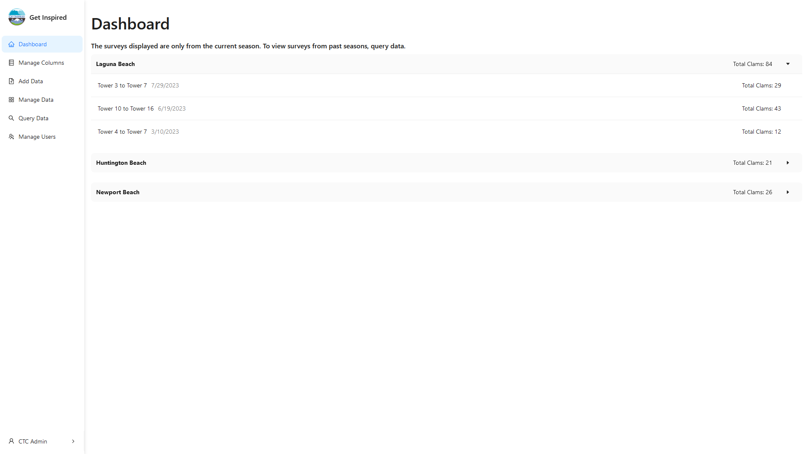
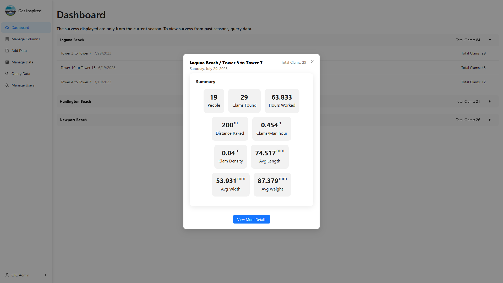
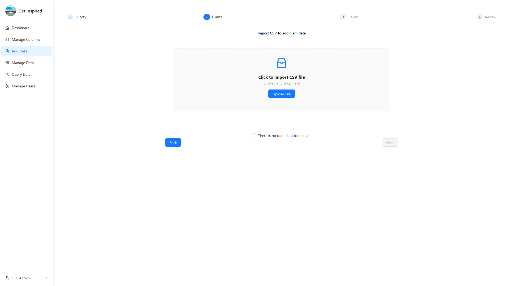
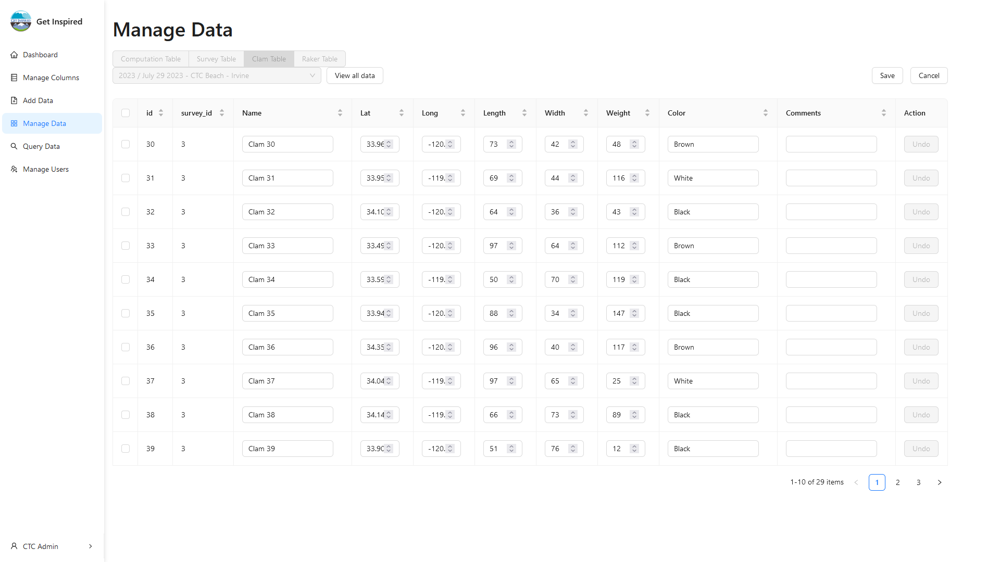
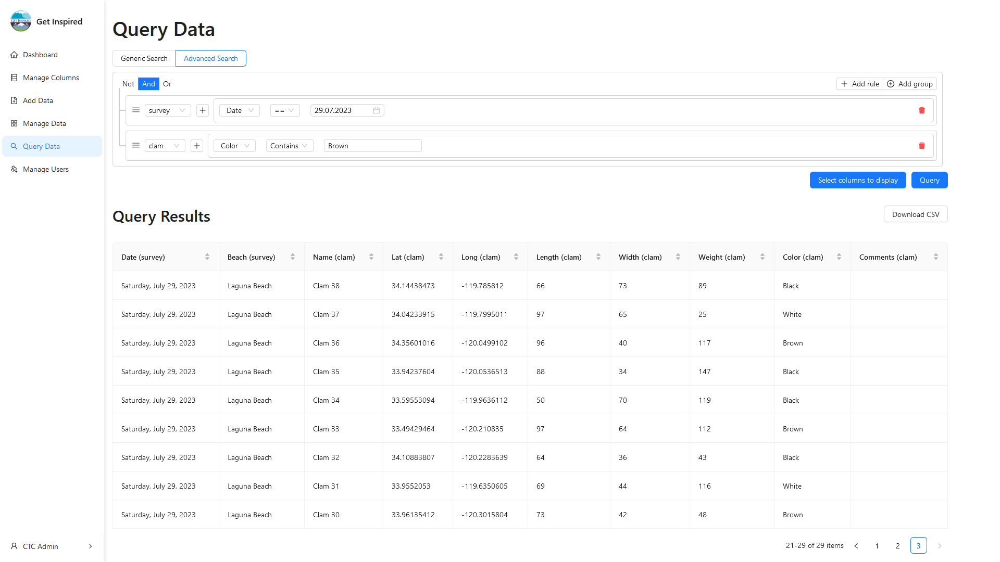

# Get Inspired
<p align="center">

</p>

<p align="center">
    <b>🌐</b><a href="https://getinspiredinc.org/">Website</a> |
    <a href="https://www.facebook.com/GetInspired20/">Facebook</a> |
    <a href="https://www.instagram.com/getinspiredinc/">Instagram</a> |
    <a href="https://www.youtube.com/user/TheKelplady">Youtube</a>
</p>

<b>Get Inspired promotes ocean restoration awareness and education among youths through engaging the community in environmental stewardship. They host programs that educate students on marine life and provide volunteer opportunities to restore and preserve marine ecosystems.</b>

<p align="center">

</p>

## 🔎 About the Project

*Nancy, the director of Get Inspired, has been maintaining Pismo clam data using spreadsheets. However, as the volume of data grows, efficiently collecting and displaying the information has become increasingly challenging.*

🆙 We built a web application and database to store and display a variety of information about Pismo clams, including their color, location, date and time of survey, and other key characteristics. Our interface allows Nancy to easily input, view, and query the data as necessary. The dashboard shows each survey's automatically calculated statistics, which will be used to identify ways to restore the clam population.

<p align="center">




</p>

### Tech Stack

**🔼 [Frontend](https://github.com/ctc-uci/get-inspired-frontend/):** React (UI Kit: [AntDesign](https://ant.design/)) + Firebase (Authentication)

**🔽 [Backend](https://github.com/ctc-uci/get-inspired-backend):** NodeJS + MySQL

---

## 💻 Development

This subsection contains further details on the more technical aspects of the project, including information for developers.


### Project branching structure

Due to complications with some of the GitHub Actions this project uses, the git branch structure is non-standard: `dev` is the main branch of the project. All PRs should be merged into this branch, as if it were the "main" branch.


## 🔨 Setting up the Development Environment

To start working on with this project, follow these steps:
1. Install [Node.js](https://nodejs.org/en) and [Yarn](https://yarnpkg.com/getting-started/install), if you haven't already.
2. Clone the repository and navigate to the project folder:
    ```
    git clone https://github.com/ctc-uci/get-inspired-backend.git
    cd get-inspired-backend
    ```
3. Place the `.env` file in the project's root directory. 
    - If you are currently maintaining this project, ask your organziation or contact CTC for the most up-to-date `.env` file.
    - If you are making the `.env` file youself, it should follow this structure:
        ```bash
        NODE_ENV=development

        # react info
        REACT_APP_HOST=
        REACT_APP_PROD_HOST=
        REACT_APP_PROD_PORT=

        # aws info
        AWS_REGION=
        AWS_HOST=
        AWS_DB_NAME=
        AWS_USER=
        AWS_PORT=
        AWS_PASSWORD=

        # react app info
        REACT_APP_EMAIL_FIRST_NAME=
        REACT_APP_EMAIL_LAST_NAME=
        REACT_APP_EMAIL_USERNAME=
        REACT_APP_EMAIL_PASSWORD=
        ```
4. Install the [EditorConfig plugin](https://editorconfig.org/#download) for your IDE.
5. Run `yarn` to install the required packages.
6. (Optionally) Run `yarn start` to run the project locally!

## Available Scripts

### Run (Development): `yarn start`
To run the project locally in development mode, use `yarn start`, then open [http://localhost:3000](http://localhost:3000) to view it in the browser. The console will show any lint errors, and the apge will reload after you make local edits to the code.


### Format: `yarn format`
Run `yarn format` to format all `.js`, `.jsx`, `.css` files with [Prettier](https://prettier.io/docs/en/index.html) (see [ESLint and Prettier](#eslint-and-prettier) below).

### Build: `yarn build`
Builds the app for production to the `build` folder.

## ESLint and Prettier

This project uses ESLint and Prettier to enforce the [Airbnb JavaScript Style Guide](https://github.com/airbnb/javascript).

### ESLint Plugins

Currently, the following ESLint plugins are installed:
- [eslint-plugin-react](https://github.com/yannickcr/eslint-plugin-react)
- [eslint-plugin-prettier](https://github.com/prettier/eslint-plugin-prettier)

Visit the links to learn more about each plugin.

### Configuration

The configuration for ESLint is inside the `.eslintrc.json` file, located in the root of the project. Learn more about ESLint [here](https://eslint.org/).

The configuration for Prettier is inside the `.prettierrc` file, located in the root of the project. Learn more about Prettier [here](https://prettier.io/docs/en/index.html).

## Husky and lint-staged

This project uses lint-staged and husky to run ESLint checks before all commits.

### Skipping pre-commit checks

Use the `--no-verify` option to skip pre-commit checks, but please note that this is **strongly discouraged**. 

### Configuration

The configuration for lint-staged is inside the `lint-staged` object inside of `package.json`. Learn more about lint-staged [here](https://github.com/okonet/lint-staged).

The configuration for husky is in the `.husky` directory, located in the root of the project. Learn more about husky [here](https://typicode.github.io/husky/).
